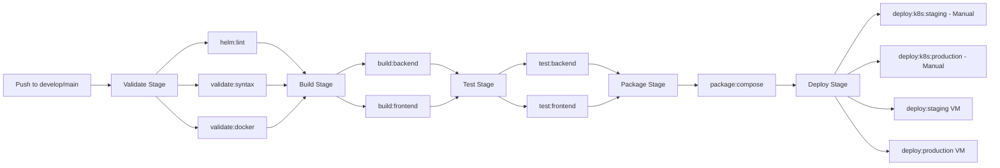

# Kubernetes & GitLab CI/CD Integration - Implementation Summary

This document describes the implementation of GitLab CI/CD integration with Kubernetes for the Ajasta application using Helm charts.

## Completed Tasks

### 1. ✅ Helm Chart Creation

Created a comprehensive Helm chart at `helm/ajasta-app/` with the following structure:

```
helm/ajasta-app/
├── Chart.yaml                      # Chart metadata
├── values.yaml                     # Default configuration values
├── README.md                       # Complete documentation
└── templates/
    ├── _helpers.tpl                # Template helper functions
    ├── namespace.yaml              # Namespace resource
    ├── postgres-secret.yaml        # PostgreSQL credentials
    ├── postgres-statefulset.yaml   # PostgreSQL database
    ├── postgres-service.yaml       # PostgreSQL service
    ├── backend-secret.yaml         # Backend secrets
    ├── backend-configmap.yaml      # Backend configuration
    ├── backend-deployment.yaml     # Backend API deployment
    ├── backend-service.yaml        # Backend service
    ├── frontend-deployment.yaml    # Frontend deployment
    ├── frontend-service.yaml       # Frontend service
    ├── ingress.yaml                # Ingress controller config
    └── serviceaccount.yaml         # RBAC service account
```

#### Chart Features

- **PostgreSQL Database**: StatefulSet with persistent volume (5Gi, Longhorn storage class)
- **Backend API**: Spring Boot application with ConfigMap and Secret management
- **Frontend**: React application served via Nginx
- **Ingress**: Nginx ingress controller with path-based routing (`/` → frontend, `/api` → backend)
- **RBAC**: ServiceAccount support
- **Parameterization**: All images, tags, replicas, resources, and secrets are configurable
- **Best Practices**: Uses helper templates, proper labels, health probes, resource limits

### 2. ✅ GitLab CI/CD Pipeline Integration

Updated `.gitlab-ci.yml` with three new jobs:

#### helm:lint (Validate Stage)

```yaml
helm:lint:
  stage: validate
  image: alpine/helm:latest
  script:
    - helm lint helm/ajasta-app
```

- Validates Helm chart syntax
- Runs on merge requests, main, and develop branches
- Catches errors before deployment

#### deploy:k8s:staging (Deploy Stage)

```yaml
deploy:k8s:staging:
  stage: deploy
  image: alpine/helm:latest
  environment: k8s-staging
  variables:
    KUBE_NAMESPACE: ajasta-staging
```

- Deploys to staging Kubernetes environment
- Triggers on `develop` branch (manual)
- Uses `helm upgrade --install` for idempotent deployments
- Overrides image tags from CI/CD pipeline
- Sets secrets and configuration from GitLab CI/CD variables

#### deploy:k8s:production (Deploy Stage)

```yaml
deploy:k8s:production:
  stage: deploy
  image: alpine/helm:latest
  environment: k8s-production
  variables:
    KUBE_NAMESPACE: ajasta
```

- Deploys to production Kubernetes environment
- Triggers on `main` branch and tags (manual)
- Includes additional production secrets (AWS, Stripe)
- 10-minute timeout for deployment

### 3. ✅ Required GitLab CI/CD Variables

Configure these in GitLab (`Settings > CI/CD > Variables`):

#### Kubernetes Access
- `KUBECONFIG_CONTENT` - Base64-encoded kubeconfig file (Protected, Masked)
- `K8S_STAGING_INGRESS_HOST` - Staging hostname (e.g., `staging.ajasta.top`)
- `K8S_PRODUCTION_INGRESS_HOST` - Production hostname (e.g., `ajasta.top`)

#### Database
- `POSTGRES_PASSWORD` - PostgreSQL password (Protected, Masked)

#### Application
- `JWT_SECRET` - JWT secret key (Protected, Masked)

#### Optional: AWS
- `AWS_ACCESS_KEY_ID` (Protected, Masked)
- `AWS_SECRET_ACCESS_KEY` (Protected, Masked)
- `AWS_S3_BUCKET`

#### Optional: Stripe
- `STRIPE_PUBLIC_KEY`
- `STRIPE_SECRET_KEY` (Protected, Masked)

### 4. ✅ Documentation

Created comprehensive documentation in `helm/ajasta-app/README.md`:

- Installation instructions
- Configuration parameters reference
- GitLab CI/CD integration guide
- KUBECONFIG generation instructions
- Helm linting and troubleshooting
- Architecture diagram

## Pipeline Workflow



## Deployment Architecture

```
Internet
   ↓
Ingress Controller (nginx)
   ├─ / → Frontend Service → Frontend Pods (Nginx + React)
   └─ /api → Backend Service → Backend Pods (Spring Boot)
                                     ↓
                            PostgreSQL Service
                                     ↓
                            PostgreSQL StatefulSet
                                     ↓
                            PersistentVolume (5Gi)
```

## How to Use

### 1. Configure GitLab CI/CD Variables

Add all required variables to your GitLab project:
- Navigate to `Settings > CI/CD > Variables`
- Add each variable from the list above

### 2. Generate KUBECONFIG

```bash
cat ~/.kube/config | base64 | tr -d '\n'
```

Add the output as `KUBECONFIG_CONTENT` variable.

### 3. Deploy to Kubernetes

1. Push changes to `develop` (staging) or `main` (production)
2. Pipeline will build Docker images
3. Navigate to `CI/CD > Pipelines`
4. Click on the running pipeline
5. Manually trigger:
   - `deploy:k8s:staging` for staging environment
   - `deploy:k8s:production` for production environment

### 4. Verify Deployment

```bash
# Check pods
kubectl get pods -n ajasta

# Check services
kubectl get services -n ajasta

# Check ingress
kubectl get ingress -n ajasta

# View logs
kubectl logs -f deployment/ajasta-backend -n ajasta
```

## Testing Helm Chart Locally

```bash
# Validate chart
helm lint ./helm/ajasta-app

# Test template rendering
helm template ajasta ./helm/ajasta-app --namespace ajasta --debug

# Install locally
helm install ajasta ./helm/ajasta-app \
  --namespace ajasta \
  --create-namespace \
  --set backend.image.tag=latest \
  --set frontend.image.tag=latest
```

## Key Features Implemented

1. **Helm Linter Integration**: Automatic validation on every merge request and branch push
2. **Idempotent Deployments**: Uses `helm upgrade --install` for safe, repeatable deployments
3. **Environment Separation**: Separate staging and production namespaces
4. **Secret Management**: GitLab CI/CD variables injected as Helm values
5. **Image Tag Override**: Dynamic image tags from CI/CD pipeline
6. **Health Checks**: Liveness and readiness probes for all services
7. **Resource Management**: CPU/memory requests and limits defined
8. **Persistent Storage**: StatefulSet with PVC for PostgreSQL
9. **Ingress Routing**: Path-based routing for frontend and backend
10. **Manual Deployment**: Controlled deployment with manual triggers

## Benefits

- **Infrastructure as Code**: Kubernetes configuration versioned in Git
- **Reproducible Deployments**: Helm ensures consistent deployments
- **Easy Rollbacks**: Helm tracks release history
- **Configuration Management**: Centralized configuration in values.yaml
- **CI/CD Automation**: Seamless integration with GitLab pipelines
- **Environment Parity**: Same chart for staging and production

## Next Steps

1. Configure the Kubernetes cluster with:
   - Nginx Ingress Controller
   - Persistent storage provider (Longhorn/Rook-Ceph)
   - SSL/TLS certificates for ingress

2. Add GitLab CI/CD variables to your project

3. Test deployment to staging environment

4. Configure monitoring and logging (Prometheus, Grafana, ELK)

5. Set up automatic backups for PostgreSQL data

## Troubleshooting

- **Helm lint fails**: Check template syntax in `helm/ajasta-app/templates/`
- **KUBECONFIG issues**: Verify base64 encoding and cluster access
- **Pod not starting**: Check `kubectl describe pod <pod-name> -n ajasta`
- **Ingress not working**: Verify ingress controller is installed and running
- **Storage issues**: Ensure Longhorn or alternative storage class exists

## References

- Helm Chart Documentation: `helm/ajasta-app/README.md`
- GitLab CI/CD Configuration: `.gitlab-ci.yml`
- Kubernetes Manifests: `helm/ajasta-app/templates/`
- Default Values: `helm/ajasta-app/values.yaml`

