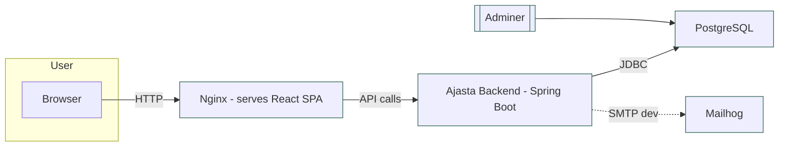
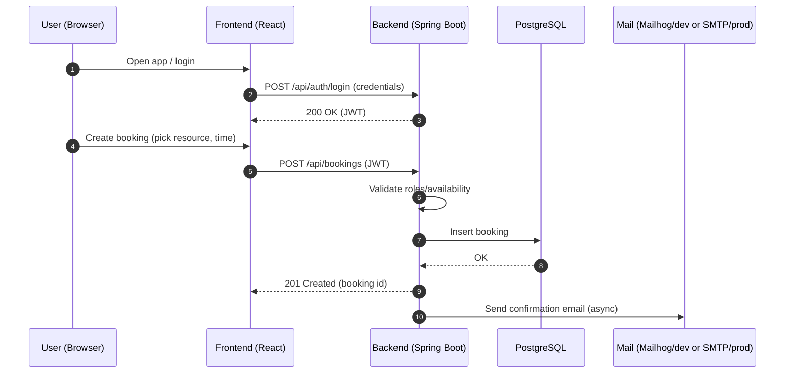

# Ajasta App

Modern appointment booking and resource scheduling platform. This monorepo contains the backend API (Spring Boot), the frontend (React served by Nginx), and all infrastructure needed to run locally with Docker Compose or on a cloud VM.

The goal is to provide an end‑to‑end setup: from development and testing on your laptop to one‑command provisioning and deployment to a virtual machine.


## Why Ajasta?
- Unified developer experience for backend, frontend, and infrastructure
- Batteries‑included local environment with DB admin and mail testing tools
- Production‑ready images and a scripted VM deployment path


## Architecture at a Glance



### Typical Booking Flow



## Repository Structure
- ajasta-backend — Spring Boot 3 (Java 21) REST API
- ajasta-react — React application served by Nginx
- ajasta-postgres — Database bootstrap/init scripts for local development
- docker-compose.yml — Core services (PostgreSQL, Backend, Frontend)
- docker-compose.override.yml — Local developer conveniences (Adminer, Mailhog, debug ports)
- scripts — One‑command build, ship, and deploy tooling
- VM_CONTAINER_MANAGEMENT.md — Manual VM container management notes
- GITLAB_VARIABLES.md — CI/CD variables reference


## Tech Stack
- Backend: Spring Boot 3.5, JPA, Security (JWT), Mail, Stripe/AWS SDK hooks
- Frontend: React SPA + Nginx static serving
- Database: PostgreSQL 16
- Local tools: Adminer (DB UI), Mailhog (email testing)
- Orchestration: Docker Compose


## Quick Start (Local)
Prerequisites: Docker and Docker Compose

Option A — plain docker compose:

```bash
docker compose pull
# or build from sources if images aren’t available yet
# docker compose build

docker compose up -d
```

Option B — helper script with dev conveniences:

```bash
./scripts/deploy-all.zsh --mode local
# add --clean for a fresh start, --skip-build to reuse images
```

Once started, you can access:
- Frontend: http://localhost:3000
- Backend API: http://localhost:8090
- PostgreSQL: localhost:15432 (db=ajastadb_dev, user=dev_user, pw=dev_password)
- Adminer: http://localhost:8080
- Mailhog: http://localhost:8025 (SMTP at localhost:1025)

Environment values for local development are preconfigured via docker-compose.override.yml.


## Deploy to a Cloud VM
The repository includes a scripted path to provision Yandex Cloud resources and deploy the same containers on a VM.

- One‑command script and full docs: scripts/README.md
- Manual container operations on the VM: VM_CONTAINER_MANAGEMENT.md
- CI/CD variables (if using GitLab): GITLAB_VARIABLES.md

Examples:
```bash
# Deploy to VM (provisions resources if necessary)
./scripts/deploy-all.zsh --mode vm

# Deploy locally and to VM in one go
./scripts/deploy-all.zsh --mode both
```


## Configuration Overview
The core configuration is exposed via environment variables and docker‑compose:
- DB_URL, DB_USERNAME, DB_PASSWORD (backend)
- JWT_SECRET (backend auth)
- Optional: STRIPE_PUBLIC_KEY/STRIPE_SECRET_KEY, AWS_ACCESS_KEY_ID/SECRET/REGION/S3_BUCKET

See docker-compose.yml and docker-compose.override.yml for concrete wiring and defaults.


## Development Notes
- Backend debugging: Java remote debug is exposed on port 5005 in local override
- Live reload/devtools enabled for local profile
- The frontend build output can be mounted for faster iteration (see override file)

Useful entry points:
- Backend code: ajasta-backend (Maven project)
- Frontend code: ajasta-react


## Project Status and Roadmap
This codebase already supports user authentication (JWT), role initialization, resource and order management primitives, email notifications via Mailhog in dev, and database migrations/init scripts for local.

Planned evolutions typically include richer booking flows, payments, and production mail/storage providers. Contributions and issues are welcome.


## Helpful Links
- Deployment tooling and deep‑dive: scripts/README.md
- VM container management: VM_CONTAINER_MANAGEMENT.md
- GitLab CI variables: GITLAB_VARIABLES.md
- Frontend README: ajasta-react/README.md


## Kubernetes Deployment (Ansible + Longhorn)
This repository includes an Ansible-based workflow to deploy Ajasta to a Kubernetes cluster with one master and three worker nodes, using Longhorn as the default StorageClass.

Prerequisites
- Ansible installed on your operator machine
- A Kubernetes control plane node (k8s-master) with kubectl configured (KUBECONFIG=/etc/kubernetes/admin.conf)
- SSH access to master and workers as defined in k8s/inventory.ini
- Internet egress for the cluster nodes to pull images and Longhorn manifests

Inventory
- Edit k8s/inventory.ini to match your master and worker IPs and SSH user. Groups used by the playbooks:
  - [k8s_master] — the control-plane node where kubectl runs
  - [k8s_workers] — all worker nodes (Longhorn and workloads run here)

Deploy full stack (ingress, Longhorn, PostgreSQL, backend, frontend)
```
ansible-playbook k8s/deploy-ajasta.yml -i k8s/inventory.ini -vv
```

Deploy only from Backend phase (Backend, Frontend, Ingress)
- Useful when cluster and PostgreSQL are already in place, or for quick app updates.
```
ansible-playbook k8s/deploy-backend.yml -i k8s/inventory.ini -vv
```

Notes about workers and Ansible PLAY RECAP
- The play targets the k8s_master host. Tasks that configure worker nodes (e.g., open-iscsi install, Longhorn checks) are executed via delegate_to to each worker.
- Because of this delegation, Ansible’s PLAY RECAP lists k8s-master as the host for most tasks. Workers are still fully configured; they just don’t appear as separate recap hosts.

Longhorn requirements and troubleshooting
- The playbook installs Longhorn v1.5.x and sets StorageClass longhorn as default.
- iSCSI initiator is required on workers. The playbook auto-installs it:
  - CentOS/RHEL/Alma/Rocky: iscsi-initiator-utils
  - Ubuntu/Debian: open-iscsi
- If PostgreSQL PVC remains Pending, check Longhorn:
  - kubectl -n longhorn-system get pods
  - kubectl -n longhorn-system logs -l app=longhorn-manager --tail=100
  - kubectl get storageclass
- Common cause: missing iscsiadm on workers (manifests will log "Failed environment check ... iscsiadm: No such file or directory"). Ensure iscsid service is active on all workers.

Backend readiness/liveness probes
- The backend’s Spring Boot actuator endpoints are secured. Kubernetes HTTP probes to /actuator/health can return 401.
- The deployment uses TCP probes on port 8090 to avoid false negatives.

## Helpful Links
- Deployment tooling and deep‑dive: scripts/README.md
- VM container management: VM_CONTAINER_MANAGEMENT.md
- GitLab CI variables: GITLAB_VARIABLES.md
- Frontend README: ajasta-react/README.md

## License
This repository may contain third‑party components with their own licenses. Unless stated otherwise, project code is provided as‑is for demonstration and development purposes.


## Test the web app with curl (Kubernetes)
This section shows quick ways to validate the deployment from both inside and outside the cluster using curl. It assumes you deployed to the `ajasta` namespace and applied the provided Ingress manifest.

Resources created by the manifests:
- Backend Service: `ajasta-backend` (ClusterIP, port 8090)
- Frontend Service: `ajasta-frontend` (ClusterIP, port 80)
- Ingress: `ajasta-ingress` (path-based rules: `/api` → backend, `/` → frontend)

Important note about backend health endpoint
- The backend secures Spring Boot Actuator endpoints, so HTTP GET /actuator/health without authentication will typically return 401. This is expected. For readiness, we use TCP probes.

Inside the cluster (via a temporary curl pod)
- Launch a throwaway curl pod in the `ajasta` namespace and test Services by their DNS names.

```bash
# Start a temporary curl pod (removed after exit)
kubectl run -n ajasta -it curl --rm \
  --image=curlimages/curl:8.10.1 --restart=Never -- sh

# From the shell inside the pod:
# 1) Frontend Service (should return 200 and some HTML)
curl -sS -o /dev/null -w "HTTP %{http_code}\n" http://ajasta-frontend/

# 2) Backend over Service DNS (connectivity check). Expect 401/404 for unauthenticated endpoints.
curl -sS -D- http://ajasta-backend:8090/api -o /dev/null

# 3) Optional: check only that the port is open (TCP-level)
#    curl will return a non-empty response or an HTTP status; success indicates connectivity.
curl -sS -o /dev/null -w "TCP OK to 8090 (HTTP %{http_code})\n" http://ajasta-backend:8090/
```

Alternative (inside cluster): port-forward to your laptop
```bash
# Backend
kubectl -n ajasta port-forward svc/ajasta-backend 18090:8090 >/dev/null 2>&1 &
# Frontend
kubectl -n ajasta port-forward svc/ajasta-frontend 18080:80   >/dev/null 2>&1 &

# Then on your machine:
curl -I http://localhost:18080/
# Backend will require auth for most endpoints; this just checks connectivity
curl -sS -D- http://localhost:18090/api -o /dev/null
```

Outside the cluster (through Ingress)
- The provided Ingress is path-based and does not require a hostname. Get the external IP and curl it directly.

```bash
# Get Ingress external IP
INGRESS_IP=$(kubectl get ingress ajasta-ingress -n ajasta -o jsonpath='{.status.loadBalancer.ingress[0].ip}')
echo "Ingress IP: ${INGRESS_IP}"

# Frontend root should return 200
curl -sS -o /dev/null -w "HTTP %{http_code}\n" http://$INGRESS_IP/

# Backend via path /api (expect 401 for protected endpoints without auth)
curl -sS -D- http://$INGRESS_IP/api -o /dev/null

# Example: check static asset is served (adjust path if your frontend uses a different index)
curl -I http://$INGRESS_IP/
```

Troubleshooting tips
- If the Ingress has no external IP yet, wait a bit or check controller status:
  - `kubectl -n ingress-nginx get pods`
  - `kubectl -n ajasta describe ingress ajasta-ingress`
- If Services don’t resolve inside the cluster, confirm the pod is in the same namespace or use fully-qualified DNS:
  - `http://ajasta-backend.ajasta.svc.cluster.local:8090`
  - `http://ajasta-frontend.ajasta.svc.cluster.local`
- If backend curls return 401, that’s expected for secured endpoints. Use authenticated requests or just verify connectivity (status code presence) as shown above.


### Get Ingress external address via Ansible (IP or hostname)
Use the lightweight playbook to print the external address of the Ingress. Depending on your environment, Kubernetes may set either an IP or a hostname on `.status.loadBalancer.ingress[]`. The playbook now reports whichever appears first and provides diagnostics and a NodePort fallback if no address is assigned yet.

```bash
ansible-playbook k8s/get-ingress-ip.yml -i k8s/inventory.ini -vv
```

Override variables as needed:

```bash
ansible-playbook k8s/get-ingress-ip.yml -i k8s/inventory.ini \
  -e app_namespace=ajasta -e ingress_name=ajasta-ingress \
  -e wait_for_ip=true -e timeout_seconds=300 -e poll_interval=5
```

If you only want to query once without waiting:

```bash
ansible-playbook k8s/get-ingress-ip.yml -i k8s/inventory.ini -e wait_for_ip=false
```

Notes
- In managed clouds, LoadBalancer provisioning can take tens of seconds or more; the app being "Ready" does not guarantee the external address is instant.
- On bare-metal or VMs without a cloud LoadBalancer, the deploy playbook automatically patches the ingress-nginx controller Service with `externalIPs` (master public IP). This lets you access the app directly on port 80 via `http://<master_public_ip>/` even if `.status.loadBalancer` is empty.
- If no address is available yet, the playbook prints:
  - Ingress describe output and recent events
  - The ingress-nginx controller Service YAML (type LoadBalancer/NodePort)
  - A fallback URL using NodePort: `http://<master_public_ip>:<nodePort>/`
- You can use the fallback to test from outside the cluster if your nodes have public IPs.


### Run networking role only (Ingress external IP patch + Longhorn check)
This repository provides a reusable Ansible role to:
- Patch the ingress-nginx controller Service with externalIPs using your master node public IP (to expose the app on port 80 without a cloud LoadBalancer)
- Check whether the Longhorn installation namespace exists (for storage readiness)

Use the dedicated playbook:

```bash
ansible-playbook k8s/patch-ingress-and-check-longhorn.yml -i k8s/inventory.ini -vv
```

Override variables as needed:

```bash
ansible-playbook k8s/patch-ingress-and-check-longhorn.yml -i k8s/inventory.ini \
  -e ingress_namespace=ingress-nginx \
  -e ingress_service_name=ingress-nginx-controller \
  -e external_ip=158.160.2.48 \
  -e ensure_longhorn_ns_check=true \
  -e longhorn_namespace=longhorn-system
```

Notes
- If `external_ip` is not provided, the role will use `ansible_host` from the first host in the `[k8s_master]` group in your inventory (the master public IP).
- The role sets `externalIPs` on the Service in an idempotent way. Re-running is safe.
- You can run this role independently before or after the full deployment to make the app reachable on `http://<master_public_ip>/` (port 80).
- Role path (for reference): `k8s/roles/ingress_externalip_longhorn_check`.


### Expose Ingress on port 80 (open VM firewall)
If your environment has no cloud LoadBalancer, the playbooks expose the Ingress via the master VM public IP. Ensure the VM firewall allows inbound 80/443.

Run the minimal role to open ports on the master:

```bash
ansible-playbook k8s/open-web-ports.yml -i k8s/inventory.ini -vv
```

- Defaults open TCP ports: 80 and 443
- Backend auto-detects firewalld (preferred on CentOS Stream 9) and falls back to iptables if firewalld is not installed
- Idempotent and safe to re-run

Override variables (optional):

```bash
ansible-playbook k8s/open-web-ports.yml -i k8s/inventory.ini \
  -e open_ports='[80,443]' \
  -e firewall_backend=auto   # or firewalld | iptables
```

After running, the role prints a summary including current firewall rules and curl checks (localhost and master public IP). If you still cannot reach `http://<master_public_ip>/`, verify your cloud security group permits inbound TCP/80 and TCP/443 to the master VM.
