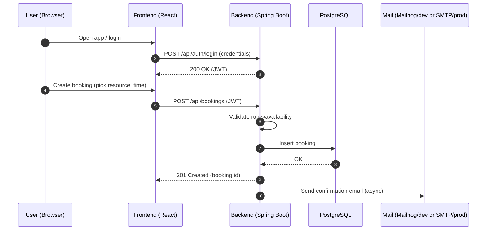

# Ajasta App

Modern appointment booking and resource scheduling platform. This monorepo contains the backend API (Spring Boot), the frontend (React served by Nginx), and all infrastructure needed to run locally with Docker Compose or on a cloud VM.

The goal is to provide an end‑to‑end setup: from development and testing on your laptop to one‑command provisioning and deployment to a virtual machine.


## Why Ajasta?
- Unified developer experience for backend, frontend, and infrastructure
- Batteries‑included local environment with DB admin and mail testing tools
- Production‑ready images and a scripted VM deployment path


## Architecture at a Glance

```mermaid
flowchart LR
  subgraph User[User]
    B[Browser]
  end

  B -->|"HTTPS/HTTP"| N[Nginx (serves React SPA)]
  N -->|"XHR/Fetch /api/*"| A[Ajasta Backend (Spring Boot)]
  A -->|"JDBC"| P[(PostgreSQL)]
  A -.->|"SMTP (dev)"| M[Mailhog]
  DevTools[[Adminer]] --> P

  classDef svc fill:#eef,stroke:#365,stroke-width:1px;
  class N,A,P,M,DevTools svc;
```

### Typical Booking Flow



## Repository Structure
- ajasta-backend — Spring Boot 3 (Java 21) REST API
- ajasta-react — React application served by Nginx
- ajasta-postgres — Database bootstrap/init scripts for local development
- docker-compose.yml — Core services (PostgreSQL, Backend, Frontend)
- docker-compose.override.yml — Local developer conveniences (Adminer, Mailhog, debug ports)
- scripts — One‑command build, ship, and deploy tooling
- VM_CONTAINER_MANAGEMENT.md — Manual VM container management notes
- GITLAB_VARIABLES.md — CI/CD variables reference


## Tech Stack
- Backend: Spring Boot 3.5, JPA, Security (JWT), Mail, Stripe/AWS SDK hooks
- Frontend: React SPA + Nginx static serving
- Database: PostgreSQL 16
- Local tools: Adminer (DB UI), Mailhog (email testing)
- Orchestration: Docker Compose


## Quick Start (Local)
Prerequisites: Docker and Docker Compose

Option A — plain docker compose:

```bash
docker compose pull
# or build from sources if images aren’t available yet
# docker compose build

docker compose up -d
```

Option B — helper script with dev conveniences:

```bash
./scripts/deploy-all.zsh --mode local
# add --clean for a fresh start, --skip-build to reuse images
```

Once started, you can access:
- Frontend: http://localhost:3000
- Backend API: http://localhost:8090
- PostgreSQL: localhost:15432 (db=ajastadb_dev, user=dev_user, pw=dev_password)
- Adminer: http://localhost:8080
- Mailhog: http://localhost:8025 (SMTP at localhost:1025)

Environment values for local development are preconfigured via docker-compose.override.yml.


## Deploy to a Cloud VM
The repository includes a scripted path to provision Yandex Cloud resources and deploy the same containers on a VM.

- One‑command script and full docs: scripts/README.md
- Manual container operations on the VM: VM_CONTAINER_MANAGEMENT.md
- CI/CD variables (if using GitLab): GITLAB_VARIABLES.md

Examples:
```bash
# Deploy to VM (provisions resources if necessary)
./scripts/deploy-all.zsh --mode vm

# Deploy locally and to VM in one go
./scripts/deploy-all.zsh --mode both
```


## Configuration Overview
The core configuration is exposed via environment variables and docker‑compose:
- DB_URL, DB_USERNAME, DB_PASSWORD (backend)
- JWT_SECRET (backend auth)
- Optional: STRIPE_PUBLIC_KEY/STRIPE_SECRET_KEY, AWS_ACCESS_KEY_ID/SECRET/REGION/S3_BUCKET

See docker-compose.yml and docker-compose.override.yml for concrete wiring and defaults.


## Development Notes
- Backend debugging: Java remote debug is exposed on port 5005 in local override
- Live reload/devtools enabled for local profile
- The frontend build output can be mounted for faster iteration (see override file)

Useful entry points:
- Backend code: ajasta-backend (Maven project)
- Frontend code: ajasta-react


## Project Status and Roadmap
This codebase already supports user authentication (JWT), role initialization, resource and order management primitives, email notifications via Mailhog in dev, and database migrations/init scripts for local.

Planned evolutions typically include richer booking flows, payments, and production mail/storage providers. Contributions and issues are welcome.


## Helpful Links
- Deployment tooling and deep‑dive: scripts/README.md
- VM container management: VM_CONTAINER_MANAGEMENT.md
- GitLab CI variables: GITLAB_VARIABLES.md
- Frontend README: ajasta-react/README.md


## License
This repository may contain third‑party components with their own licenses. Unless stated otherwise, project code is provided as‑is for demonstration and development purposes.
