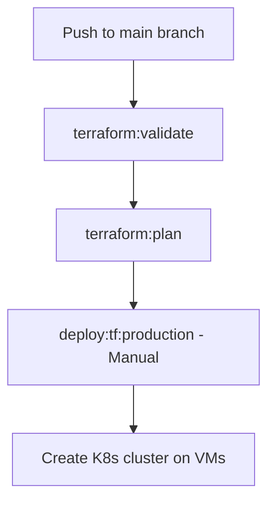
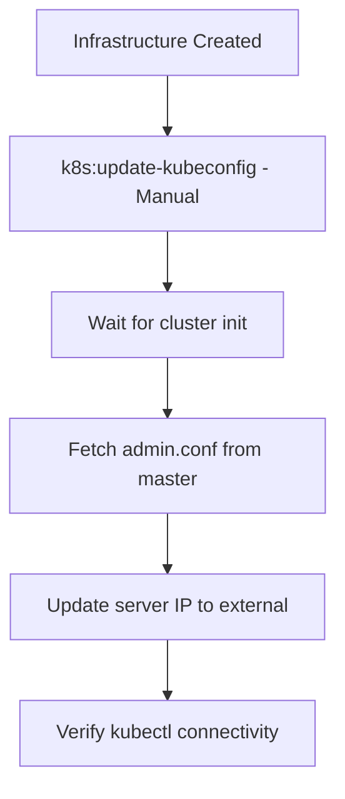
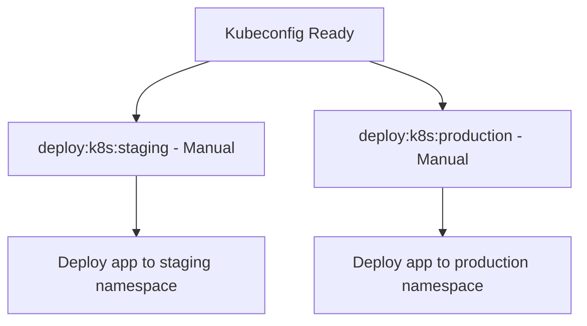

# Kubernetes Deployment Workflow

This document explains the complete workflow for deploying the Ajasta application to a Kubernetes cluster created with Terraform.

## Overview

The deployment process now creates a complete infrastructure pipeline:
1. **Terraform Infrastructure** → Creates VMs and Kubernetes cluster
2. **Kubeconfig Update** → Automatically configures kubectl access
3. **Application Deployment** → Deploys Ajasta app to the cluster

## Deployment Flow

### Phase 1: Infrastructure Creation (Terraform)



**Jobs:**
- `terraform:validate` - Validate Terraform syntax
- `terraform:plan` - Generate execution plan
- `deploy:tf:production` - **Manual** infrastructure deployment

**Triggers:**
- Automatic on `develop` branch
- Manual on `main` branch

### Phase 2: Kube Configuration



**Jobs:**
- `k8s:update-kubeconfig` - **Manual** kubeconfig setup

**What it does:**
1. Waits 60 seconds for cluster initialization
2. Runs `scripts/update-kubeconfig.sh` with master IP
3. Fetches `/etc/kubernetes/admin.conf` from master VM
4. Updates server URL from `127.0.0.1:6443` to external IP
5. Tests kubectl connectivity
6. Verifies cluster nodes are accessible

### Phase 3: Application Deployment



**Jobs:**
- `deploy:k8s:staging` - **Manual** deployment to staging
- `deploy:k8s:production` - **Manual** deployment to production

## Manual Deployment Steps

### 1. Deploy Infrastructure

```bash
# In GitLab CI/CD > Pipelines
# 1. Push to main branch
git push origin main

# 2. Run terraform:plan (automatic)
# 3. Run deploy:tf:production (manual)
```

### 2. Update Kubeconfig

```bash
# After infrastructure is ready
# Run k8s:update-kubeconfig (manual)
```

The job will:
- Use the master IP from Terraform outputs
- Automatically configure kubectl access
- Verify connectivity

### 3. Deploy Application

```bash
# After kubeconfig is updated
# Choose environment:

# Staging (develop branch)
git push origin develop
# Then run deploy:k8s:staging (manual)

# Production (main branch)
# Then run deploy:k8s:production (manual)
```

## Key Files

### Infrastructure
- `terraform/` - Terraform configuration
- `.gitlab-ci-terraform.yml` - Terraform CI/CD pipeline

### Kubeconfig Management
- `scripts/update-kubeconfig.sh` - Automated kubeconfig update script

### Application Deployment
- `k8s/` - Kubernetes manifests
- `helm/ajasta-app/` - Helm charts

## Environment Variables

### Required for Terraform
```bash
YC_CLOUD_ID          # Yandex Cloud ID
YC_FOLDER_ID         # Yandex Cloud Folder ID
YC_TOKEN              # Yandex Cloud IAM token
YC_SSH_PRIVATE_KEY     # SSH private key for VM access
```

### Generated Automatically
```bash
TERRAFORM_MASTER_IP   # Master VM IP address
TERRAFORM_WORKER_IPS   # Worker VM IP addresses
TERRAFORM_CLUSTER_READY=true
```

## SSH Access Requirements

The kubeconfig update requires SSH access to the master VM:

```bash
# SSH key should be configured in GitLab CI/CD variables
# The master VM user is: ajasta
# SSH key path: ~/.ssh/id_rsa (or specified in script)
```

## Troubleshooting

### Kubeconfig Issues
```bash
# Test manual kubeconfig update
./scripts/update-kubeconfig.sh <MASTER_IP>

# Verify kubectl access
export KUBECONFIG=$HOME/.kube/config
kubectl cluster-info
kubectl get nodes
```

### SSH Connection Issues
```bash
# Test SSH connection to master
ssh -i ~/.ssh/id_rsa ajasta@<MASTER_IP>

# Check if master VM is accessible
ping <MASTER_IP>
```

### Terraform Issues
```bash
# Check Terraform state
cd terraform
terraform show
terraform plan
```

## Example Complete Workflow

```bash
# 1. Developer pushes changes
git add .
git commit -m "Update application"
git push origin main

# 2. Infrastructure deployment (in GitLab CI/CD)
# - terraform:validate (auto)
# - terraform:plan (auto)
# - deploy:tf:production (manual)

# 3. Kubeconfig update (in GitLab CI/CD)
# - k8s:update-kubeconfig (manual)

# 4. Application deployment (in GitLab CI/CD)
# - deploy:k8s:production (manual)

# 5. Verify deployment
kubectl get all -n ajasta
kubectl get ingress -n ajasta
curl http://<MASTER_IP>/
```

## Next Steps After Deployment

1. **Access the application**: http://<MASTER_IP>/
2. **Monitor the cluster**: `kubectl get all -n ajasta`
3. **Check logs**: `kubectl logs -n ajasta deployment/ajasta-backend`
4. **Scale if needed**: `kubectl scale deployment/ajasta-backend --replicas=3 -n ajasta`

## Security Considerations

- SSH keys should be protected in GitLab CI/CD variables
- Kubeconfig contains sensitive cluster credentials
- Network access should be restricted to necessary IPs
- Regular security updates for the cluster and VMs